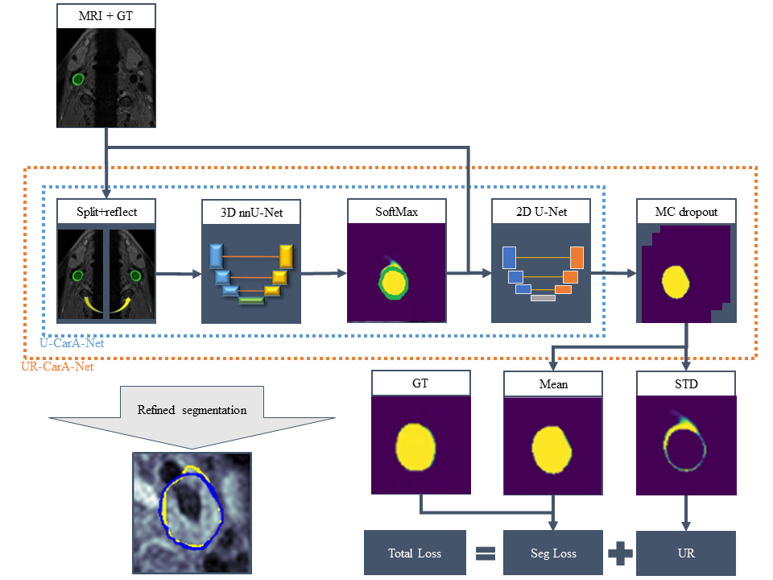

# UR-CarA-Net

We present a fully automated method for carotid artery (CA) outer wall segmentation in black blood MRI using partially annotated data and compare it to the state-of-the-art reference model. Our model was trained and tested on multicentric data of patients (106 and 23 patients, respectively) with a carotid plaque and was validated on different MR sequences (24 patients) as well as data that were acquired with MRI systems of a different vendor (34 patients). A 3D nnU-Net was trained on pre-contrast T1w turbo spin echo (TSE) MR images. A CA centerline sliding window approach was chosen to refine the nnU-Net segmentation using an additionally trained 2D U-Net to increase agreement with manual annotations. To improve segmentation performance in areas with semantically and visually challenging voxels, Monte-Carlo dropout was used. To increase generalizability, data were augmented with intensity transformations. Our method achieves state-of-the-art results yielding a Dice similarity coefficient (DSC) of 91.7\% (interquartile range (IQR) 3.3\%) and volumetric intraclass correlation (ICC) with ground truth of 0.90 on the development domain data and a DSC of 91.1\% (IQR 7.2\%) and volumetric ICC with ground truth of 0.83 on the external domain data outperforming top-ranked methods for open-source CA segmentation. The uncertainty-based approach increases the interpretability of the proposed method by providing an uncertainty map together with the segmentation.

