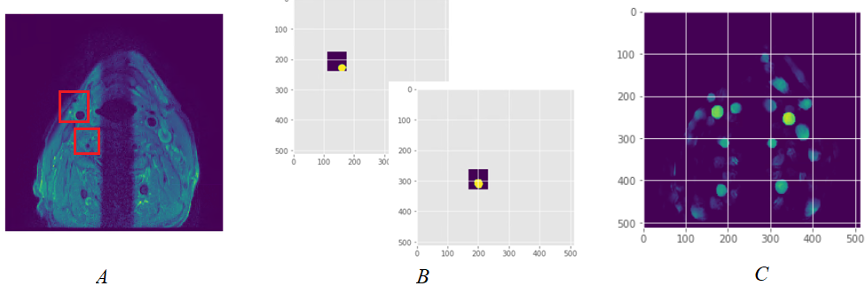

# Multi-patch consensus U-Net for automated detection and segmentation of carotid arteries on black blood MR images  

Elizaveta Lavrova, Henry C Woodruff, Mohamed Kassem, Zohaib Salahuddin, Sergey Primakov, Paul Nederkoorn, Daniel Bos, Jeroen Hendrikse, M. Eline Kooi, Philippe Lambin  
    
This is a repository containing the code for the plaq-u-net paper. If you are going to use it or its parts, please, cite it accordingly.
  
## Abstract
We present a method for carotid artery (CA) detection on black blood (BB) MRI using partially annotated data and its comparison to reference and state-of-art models. The models were trained and tested on multi-center data, including external validation. The 2D U-Net was trained on patches of MRI slices containing CA outer wall contours. Slices from the test set were scanned by a sliding window. A consensus CA probability map was calculated from the overlapping U-Net outcomes. To increase generalizability, data was augmented with intensity transformations. Model performance yielded median slice-wise Dice similarity coefficient (DSC) of 0.90 and 0.82 for test and external sets, respectively.
  
The U-Net architecture:

  
Model inference: A - patching with a sliding window of 64×64 pixels, B - vessels detection with U-Net in every patch, C - an inter-patch consensus probability map   

